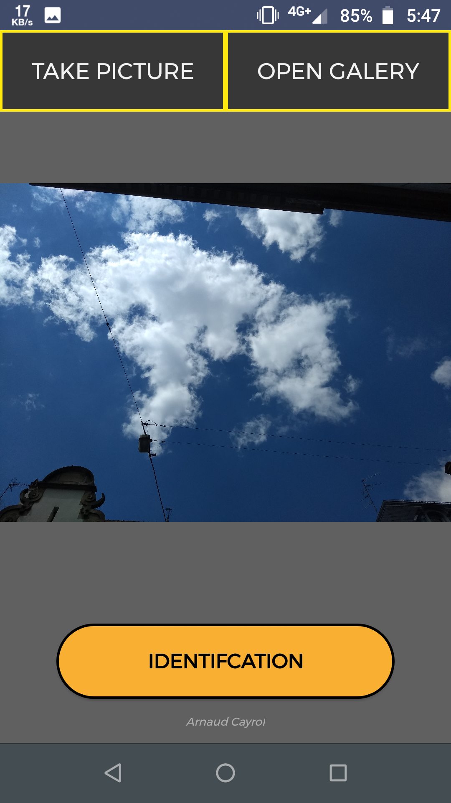
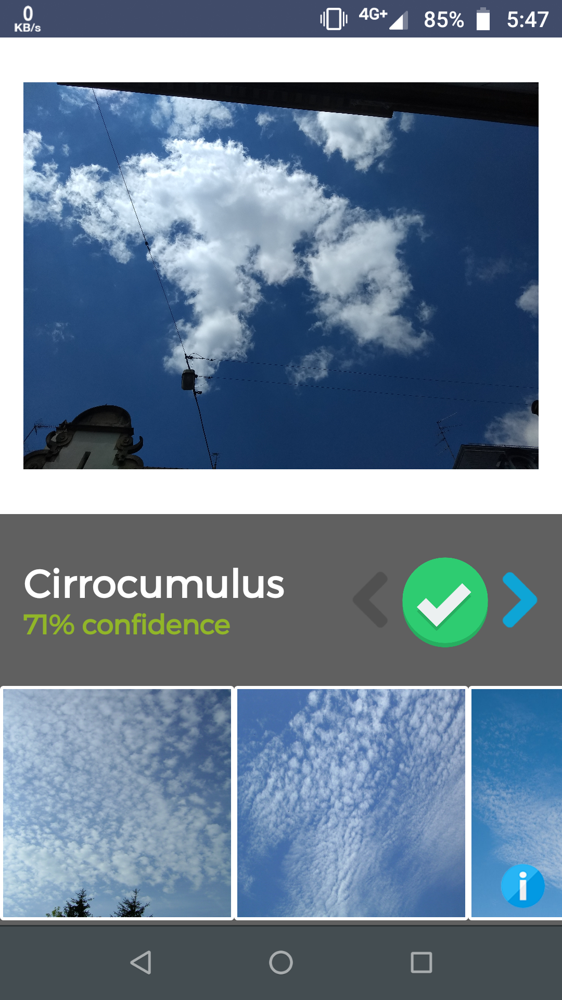

This app allows you to discover the name of clouds by taking a photo of it or choosing one from your gallery.
This is possible thanks to a Deep Learning model that analyses the picture.
The image is sent to a remote server that handles all the calculation and returns the predicted name in less than 3 seconds.

 
